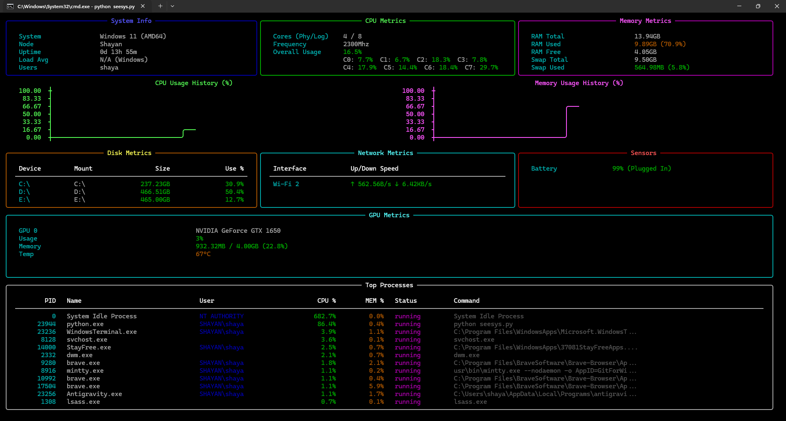

<div align="center">


# seesys
```A terminal-based real-time infrastructure monitor written in Python using rich and psutil.```
</div>


## Features (version v1.0.2)
- GPU Monitoring (NVIDIA)
- Historical ASCII Line Graphs for CPU & Memory 
- And **v1.0.1 features**

## Features (version v1.0.1)
- Process list and sensor details
- And **v1.0.0 features**

## Features (version v1.0.0)
- Real-time CPU, Memory, Disk, and Network monitoring
- Fully terminal-based UI with beautiful layouts

## Screenshot


## Installation

You can install `seesys` on any platform via our one-liner install scripts. They automatically download the correct binary for your OS and set it up in your PATH.


### Windows (PowerShell)
```powershell
irm https://raw.githubusercontent.com/shayansaha85/seesys/master/install.ps1 | iex
```

### Linux / macOS (Bash)
```bash
curl -sL https://raw.githubusercontent.com/shayansaha85/seesys/master/install.sh | bash
```

## Running from Source

1. Clone the repository
2. Install requirements: `pip install -r requirements.txt`
3. Run the script: `python seesys.py`

## Automatic Builds
This repository contains a `.github/workflows/release.yml` GitHub Actions workflow. When you create a new Release in GitHub, it will automatically build the cross-platform executables using PyInstaller and attach them to the release. Users running the install scripts will automatically fetch the latest release.
